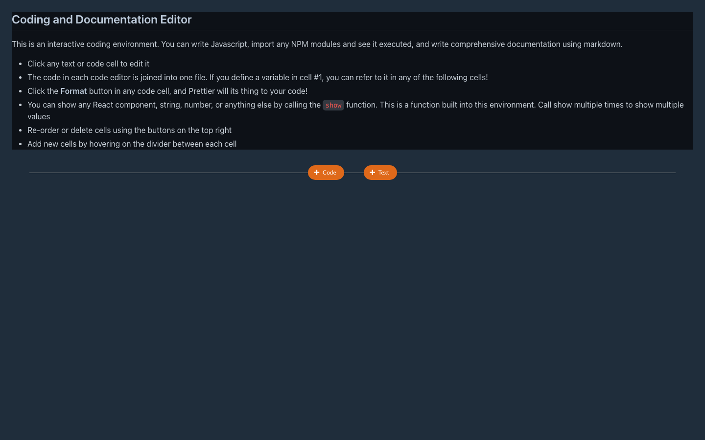
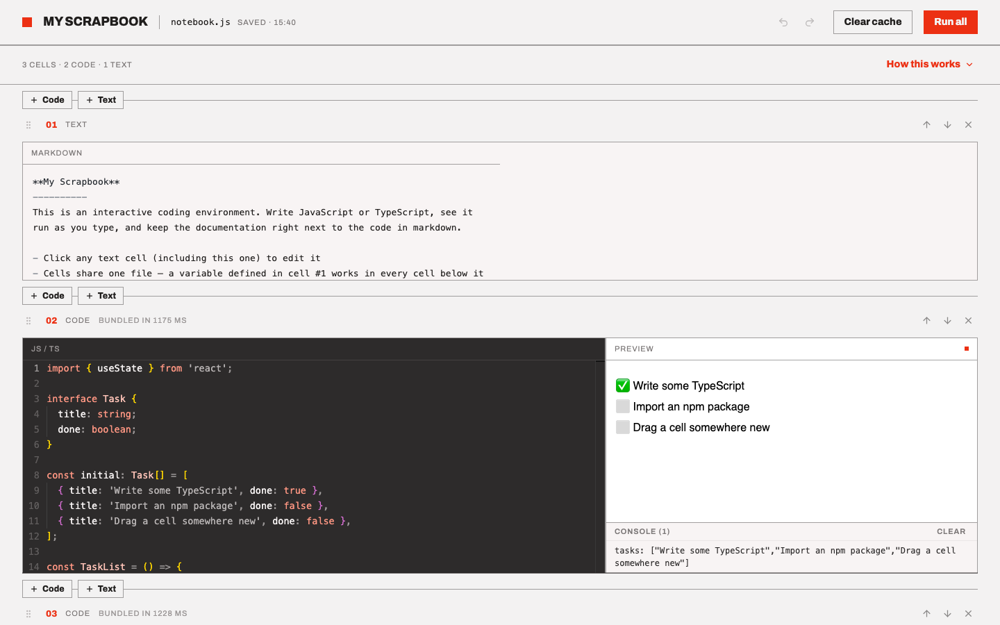
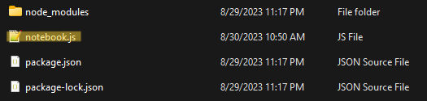
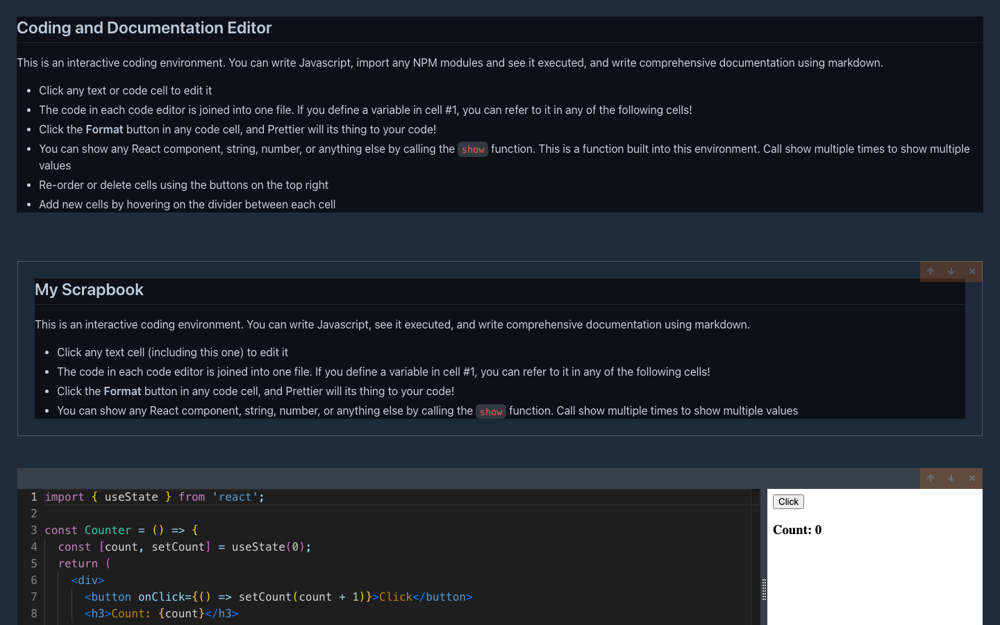

# Getting Started with My Scrapbook - a dynamic coding environment.

## What is My Scrapbook, and what does it do?

- It's a full-featured in-browser IDE and markdown editor for documentation.
- You can import any npm module in the IDE. The bundling and transpiling of your code are handled in the browser.
- React and ReactDOM are already imported and ready for use.
- All of your text and code are automatically saved to a file named notebook.js

## Install Instructions.

- You'll need [Node.js](https://nodejs.org/) 18 or newer.
- Open a folder on your terminal where you don't mind a few files being written.
- Run the following command:
```
npm i my-scrapbook
```
## To Run My Scrapbook

- In the same folder you install My Scrapbook, open up a terminal session and run:

```
npx my-scrapbook
```
- Your browser opens to the notebook automatically. (Prefer to open it yourself? Pass `--no-open` and **Ctrl + click** the **http://localhost:4005** link in the terminal.)
- Want a different port or a named notebook? Both are options of the `serve` command (running `npx my-scrapbook` alone is shorthand for `npx my-scrapbook serve notebook.js`):

```
npx my-scrapbook serve mynotes.js -p 4200
```
- Click **Code cell** or **Text cell** on the start screen to create your first cell. After that, use the **+ Code** / **+ Text** buttons between cells to add more.
  
  
- All your work is saved to the file **notebook.js**.
- Next time you run the application using the same command, it will open to your previous **notebook.js** file.
- If you want to start a new notebook and don't care about the saved work from your previous session, delete the **notebook.js** file in the same directory before starting My Scrapbook again. (Or you could leave the **notebook.js** and click the **X** button on all your previous work once the IDE is loaded into the browser.)
- If you want to keep your previous work and start a new notebook, rename or move the **notebook.js** file in the same directory before starting My Scrapbook again.


## Export a notebook to Markdown

- To turn a notebook into a plain markdown file you can share anywhere (GitHub, a blog, a teammate without My Scrapbook), run:

```
npx my-scrapbook export
```
- This writes **notebook.md** next to **notebook.js**: text cells come through as-is, and code cells become fenced ` ```jsx ` blocks.
- Exporting a named notebook to a specific file works too:

```
npx my-scrapbook export mynotes.js -o docs/mynotes.md
```

## What's new in 3.5

- **TypeScript in code cells.** Interfaces, type annotations, and generics all work — the editor highlights TS properly, the **Format** button understands it, and types are stripped when your code runs (no type checking). Plain JavaScript works exactly as before.

## What's new in 3.4

- **Console output in the preview.** `console.log` (and `info`/`warn`/`error`/`debug`) from your code now shows up in a console panel right under the preview — objects serialized, warnings and errors highlighted, with a **Clear** button. No more digging through the browser devtools.
- **The preview no longer goes randomly blank.** Bundled code used to be handed to the preview on a fixed timer and was silently lost if the preview loaded slower; it's now delivered on an explicit ready signal, every time.

## What's new in 3.3

- **Markdown export.** `npx my-scrapbook export` turns a notebook into a plain markdown file you can share anywhere — see "Export a notebook to Markdown" above.
- **Smoother start.** A bare `npx my-scrapbook` now opens `notebook.js` and launches your browser automatically (pass `--no-open` to opt out). The CLI also reports its version with `--version` and warns at install time on Node versions older than 18.

## What's new in 3.2

- **Redesigned UI.** A light, flat look with a single red accent replaces the old dark theme: a sticky header with the notebook's save state, undo/redo, **Clear cache**, and **Run all**; a collapsible "How this works" guide; a start screen for empty notebooks; numbered cell headers with live bundle timing; and always-visible add-cell rails. Same features, new chrome.

## What's new in 3.1

- **Undo/redo**: toolbar buttons plus Ctrl/Cmd+Z, Ctrl+Y, and Ctrl/Cmd+Shift+Z. Typing bursts undo as one step; the shortcuts stay out of the way while you're typing inside an editor.
- **Works fully offline**: the editor and fonts are bundled with the app, and npm packages you've used before are served from a local cache — a badge tells you when you're offline, and a button clears the module cache to pick up fresh package versions.

## What's new in 3.0

- Rebuilt on a modern toolchain: Vite, TypeScript 5, React 18, and Redux Toolkit.
- The in-browser bundler ships its own copy of esbuild, so bundling no longer depends on a CDN.
- A crashed cell shows an error message with a Reset button instead of taking down the whole notebook.
- The save API validates what it writes, and a corrupted notebook.js can no longer crash the server.
- Versions 2.x are deprecated on npm: they can no longer render React components (they relied on an API that current React, served from unpkg, removed).

## Markdown sample text for the text editor that contains an "Explainer".

```
**My Scrapbook** 
----------
This is an interactive coding environment. You can write Javascript, see it executed, and write comprehensive documentation using markdown. 

- Click any text cell (including this one) to edit it 
- The code in each code editor is joined into one file. If you define a variable in cell #1, you can refer to it in any of the following cells!
- Click the **Format** button in any code cell, and Prettier will its thing to your code!
- You can show any React component, string, number, or anything else by calling the `show` function. This is a function built into this environment. Call show multiple times to show multiple values
- Re-order or delete cells using the buttons on the top right
- Add new cells with the **+ Code** / **+ Text** buttons between cells

All of your changes get saved to the file you opened My Scrapbook with. So if you ran `npx my-scrapbook serve`, all of the text and code you write will be saved to the `notebook.js` file.

```

## Code samples for the code editor.

```
import { useState } from 'react';

const buttonStyle = {
  padding: '10px 20px',
  fontSize: '16px',
  borderRadius: '4px',
  fontWeight: 600,
  backgroundColor: '#007BFF',
  color: '#ffffff',
  transition: 'background-color 0.3s, transform 0.3s, color 0.3s',
  margin: '10px',
};

const hoverStyles = {
  ...buttonStyle,
  backgroundColor: '#0056b3',
};

const countStyle = {
  fontSize: '20px',
  fontWeight: 'bold',
   fontFamily: 'Arial, sans-serif',
  color: '#333',
  marginTop: '20px',
  border: '1px solid #007BFF',
  padding: '10px',
  borderRadius: '4px',
};

const Counter = () => {
  const [isAddHovered, setIsAddHovered] = useState(false); // for Add button
  const [isResetHovered, setIsResetHovered] = useState(false); // for Reset button
  const [count, setCount] = useState(0);
  return (
    <div>
      <button
        style={isAddHovered ? hoverStyles : buttonStyle}
        onMouseEnter={() => setIsAddHovered(true)}
        onMouseLeave={() => setIsAddHovered(false)}
        onClick={() => setCount(count + 1)}
      >
        Add to Count
      </button>
      <button
        style={isResetHovered ? hoverStyles : buttonStyle}
        onMouseEnter={() => setIsResetHovered(true)}
        onMouseLeave={() => setIsResetHovered(false)}
        onClick={() => setCount(0)}
      >
        Reset
      </button>
      <h3 style={countStyle}>Count: {count}</h3>
    </div>
  );
}; // Display any variable or React Component by calling 'show'
show(<Counter />);

```

```
import axios from 'axios';
import 'bulma/css/bulma.css';

axios
  .get('https://jsonplaceholder.typicode.com/users/1')
  .then(({ data }) => show(data.name))
  .catch(error => console.error('There was an error!', error));
```


## Development

The code lives in [`jbook/`](jbook), an npm-workspaces monorepo with four packages: the `my-scrapbook` CLI, the Express API (`local-api`), the browser app (`local-client`, built with Vite), and shared TypeScript types (`types`). You'll want Node 20+ for development.

```
cd jbook
npm install
npm test
```

To work on the browser app with hot reload, run `npm start` in `jbook/packages/local-client` (it serves on port 3000; run the CLI's `serve` command alongside it to have a real API to talk to). Each package's README has more detail, and CI runs the builds and tests on every pull request.

## Changelog

See [CHANGELOG.md](CHANGELOG.md) for the release history.

## Roadmap

See [TODO.md](TODO.md) for what's done and what's planned — larger ideas include undo/redo, offline caching of npm modules, and collaborative editing.
